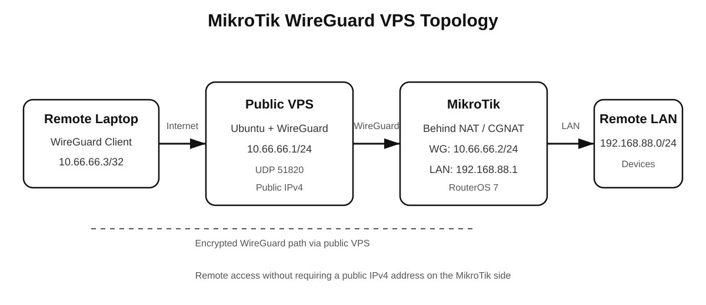

# MikroTik WireGuard VPS

Remote access to a MikroTik LAN behind NAT/CGNAT using WireGuard through a public VPS.

This project demonstrates how to build a secure WireGuard VPN where a public VPS acts as a central hub between a remote client and a MikroTik router located behind NAT or CGNAT.

## Network Topology

```text
Remote Laptop
WireGuard: 10.66.66.3
        │
        │ Internet
        ▼
Public VPS
WireGuard: 10.66.66.1
        │
        │ WireGuard
        ▼
MikroTik behind NAT / CGNAT
WireGuard: 10.66.66.2
LAN: 192.168.88.1
        │
        ▼
Remote LAN
192.168.88.0/24
        │
        ├── Camera
        ├── Telemetry
        └── UART-Ethernet adapter
```

## What This Project Provides

- Remote access to a MikroTik router without requiring a public IP on the MikroTik side
- Access to devices inside the remote `192.168.88.0/24` LAN
- WireGuard tunnel through a VPS with a public IPv4 address
- Support for MikroTik connections behind NAT or CGNAT
- Automatic tunnel recovery after VPS reboot
- Routed VPN design without unnecessary NAT inside the WireGuard network

## Tested

The complete connection was tested successfully:

`Remote Laptop → VPS → MikroTik → Remote LAN device`

A remote WireGuard client was able to reach a device at `192.168.88.88` behind the MikroTik router.

## IP Addressing

| Device | Interface | IP Address |
|---|---|---|
| VPS | WireGuard | `10.66.66.1/24` |
| MikroTik | WireGuard | `10.66.66.2/24` |
| Remote Laptop | WireGuard | `10.66.66.3/32` |
| MikroTik | LAN | `192.168.88.1/24` |
| Remote LAN | Network | `192.168.88.0/24` |

## WireGuard Peers

The VPS acts as the WireGuard hub and has two peers:

```text
VPS
10.66.66.1
│
├── MikroTik
│   WireGuard: 10.66.66.2
│   Remote LAN: 192.168.88.0/24
│
└── Remote Laptop
    WireGuard: 10.66.66.3
```

The MikroTik initiates the WireGuard connection to the VPS, which allows the setup to work even when the router is behind NAT or CGNAT.

No inbound port forwarding is required on the MikroTik Internet connection.

## Components

### VPS

- Ubuntu Server 24.04 LTS
- Public IPv4 address
- WireGuard
- IPv4 forwarding enabled
- WireGuard service managed by `systemd`
- UDP port `51820`

### MikroTik

- RouterOS 7
- WireGuard interface
- WAN connection can be behind NAT or CGNAT
- LAN network `192.168.88.0/24`
- Persistent Keepalive enabled for the VPS peer

### Remote Client

- Windows
- Official WireGuard client
- WireGuard address `10.66.66.3/32`
- Routes only the VPN and remote LAN networks through the tunnel

## Repository Structure

```text
mikrotik-wireguard-vps/
├── README.md
├── configs/
│   ├── vps-wg0.example.conf
│   ├── mikrotik.example.rsc
│   └── windows-client.example.conf
├── docs/
│   ├── SETUP.md
│   └── TESTING.md
└── images/
    └── network-topology.svg
```

All configuration files in this repository use example addresses and placeholder keys.

Never publish real WireGuard private keys.


## How It Works

1. The MikroTik router establishes an outbound WireGuard tunnel to the public VPS.
2. The remote laptop establishes a separate WireGuard tunnel to the same VPS.
3. The VPS acts as the central WireGuard hub and routes traffic between the peers.
4. The MikroTik routes traffic between the WireGuard network and its local LAN.
5. The remote laptop can access devices inside `192.168.88.0/24` through the encrypted tunnel.

```text
Laptop
   │
   │ WireGuard
   ▼
  VPS
   │
   │ WireGuard
   ▼
MikroTik
   │
   │ LAN
   ▼
Remote Device
```

This design does not depend on the MikroTik having a static or public IPv4 address. The MikroTik initiates the connection to the VPS and uses Persistent Keepalive to maintain connectivity through NAT.

## Routing

The VPS routes the remote LAN through the MikroTik WireGuard peer:

```text
192.168.88.0/24 → MikroTik peer
```

The MikroTik WireGuard peer allows traffic back to the remote client:

```text
10.66.66.3/32 → VPS peer
```

The Windows WireGuard client routes the VPN endpoints and remote LAN through the tunnel:

```text
10.66.66.1/32
10.66.66.2/32
192.168.88.0/24
```

Internet traffic on the laptop is not routed through the VPS.

## Security

- Keep all WireGuard private keys secret.
- Never commit real private keys to a public repository.
- Replace public IP addresses and public keys with placeholders in shared configuration examples.
- Restrict VPS firewall rules to the services that are actually required.
- Keep Ubuntu, RouterOS, and WireGuard clients updated.
- Use SSH keys instead of password authentication where possible.

## Documentation

Detailed instructions are available in:

- [`docs/SETUP.md`](docs/SETUP.md) — complete installation and configuration guide
- [`docs/TESTING.md`](docs/TESTING.md) — connectivity and routing verification
- [`configs/`](configs/) — sanitized example configurations

## Tested Environment

The project was tested with:

- Ubuntu Server 24.04 LTS VPS
- MikroTik RouterOS 7
- WireGuard for Windows
- MikroTik behind NAT
- Remote LAN `192.168.88.0/24`
- WireGuard network `10.66.66.0/24`

The tunnel and routes were also verified after a complete VPS reboot to confirm automatic recovery.

## Author

Created by **bmax-sys** as a practical networking project for remote access to MikroTik-based systems.
